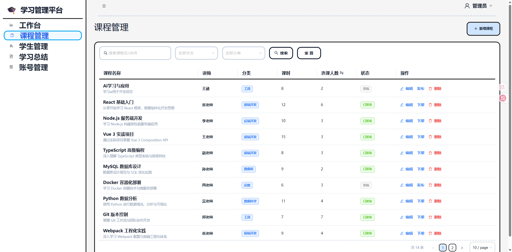
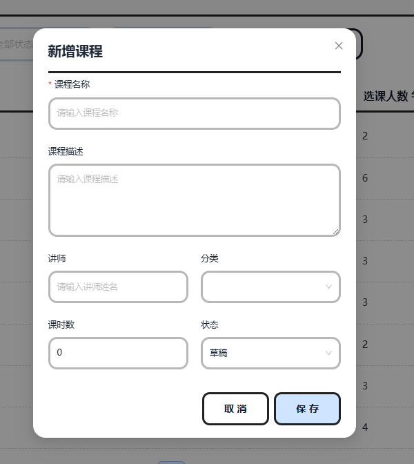
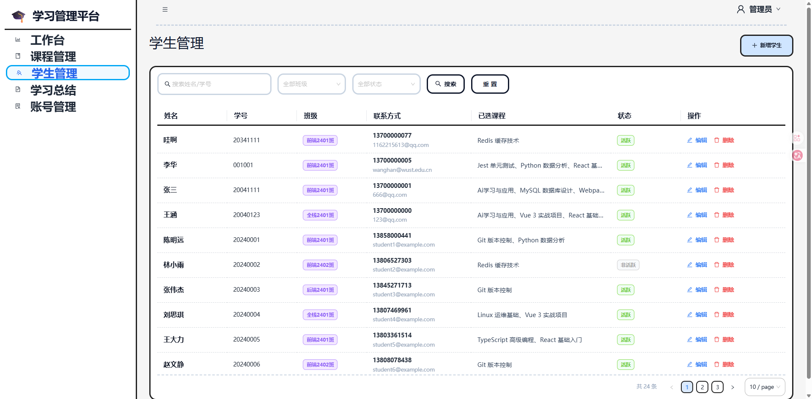
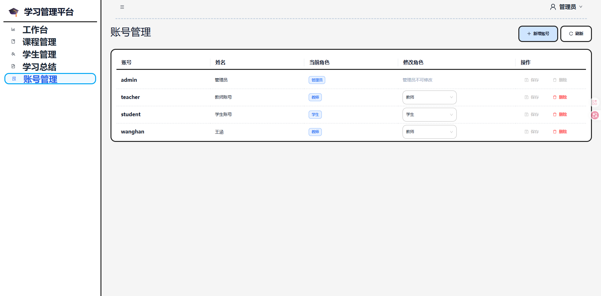
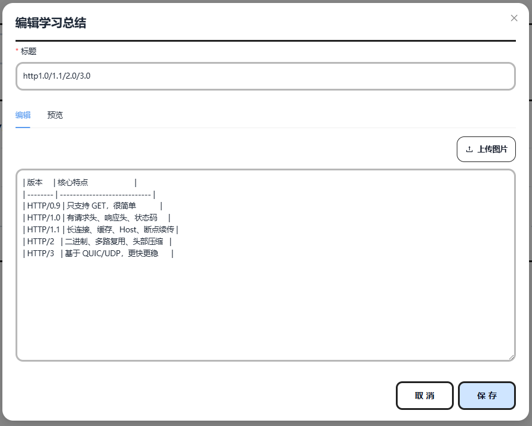
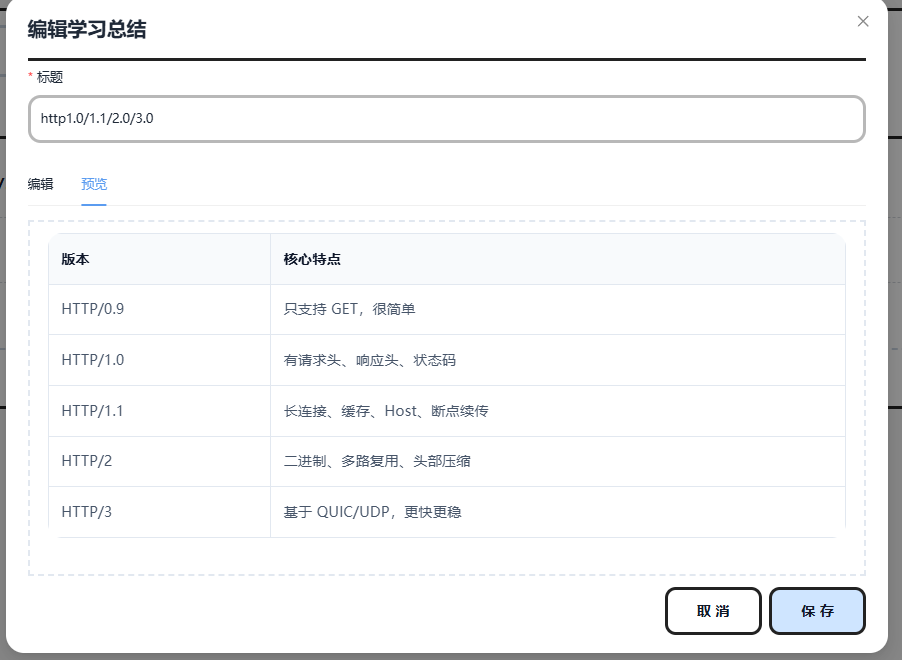

# EduFlow 在线课程管理平台

EduFlow 是一个基于 React + TypeScript 的在线课程后台管理系统，覆盖登录鉴权、课程管理、学生管理、Markdown 学习笔记、账号管理、数据看板和权限控制等后台核心能力。后端基于 Koa + SQLite 提供 REST API、JWT 鉴权和静态资源访问。

## 预览图

> 图片位于 `docs/images`，可在 GitHub README 中直接预览。

## 预览图

| 登录与工作台 
| --- |
|  | 

| 课程管理 | 新增课程 | 
| --- | --- |
|  |  |

| 学生管理 |
| --- |
|  |
| 账号管理 |
| --- | 
|  |  |

|  学习笔记编辑 |学习笔记编辑预览 |
| --- |--- |
||  |


## 技术栈

**前端**

- React 19
- TypeScript
- Vite
- React Router
- Zustand
- Axios
- Ant Design
- Tailwind CSS
- ECharts
- react-markdown / remark-gfm
- react-syntax-highlighter

**后端**

- Koa
- @koa/router
- better-sqlite3
- jsonwebtoken
- bcryptjs

## 核心功能

- 登录鉴权：JWT 登录、登录态持久化、刷新恢复、401 失效清理。
- 权限控制：基于固定角色权限码实现菜单、路由、按钮和接口四层权限控制。
- 数据看板：展示课程数量、学生数量、发布率、活跃率、选课排行、学习活跃趋势等统计图表。
- 课程管理：支持课程列表、搜索筛选、分页排序、新增、编辑、删除、发布/下架。
- 学生管理：支持学生列表、班级/状态筛选、新增、编辑、删除、多课程选择和学号唯一性校验。
- 学习笔记：支持 Markdown 编辑预览、代码高亮、代码复制和图片上传。
- 账号管理：管理员可新增/删除教师和学生账号，并切换教师/学生角色。
- 静态资源访问：后端提供前端构建产物托管和上传图片访问能力。

## 项目亮点

### 1. 路由鉴权闭环

项目基于 React Router 设计公开路由和受保护路由。登录页独立开放，后台页面统一包裹在鉴权布局下。

刷新页面后，前端会读取本地 token 并调用 `/api/auth/me` 校验登录态。校验通过后恢复用户信息和权限列表；校验失败则清空 token 和业务状态，回到登录页。

### 2. RBAC 权限控制

项目采用固定角色权限模型，内置 `admin`、`teacher`、`student` 三类角色。后端根据角色返回权限码，前端根据权限码控制：

- 菜单是否展示
- 路由是否允许访问
- 按钮是否渲染

后端接口同时通过 JWT 鉴权和权限中间件做接口级校验，避免用户绕过前端直接调用接口造成越权操作。

### 3. Zustand 业务状态拆分

项目按业务领域拆分 Zustand store：

- `auth-store`：登录态、用户信息、权限判断、全局错误。
- `course-store`：课程列表、筛选分页、弹窗状态、编辑和删除流程。
- `student-store`：学生列表、班级/课程支持数据、表单和删除状态。
- `summary-store`：学习笔记列表、详情、编辑和预览状态。
- `dashboard-store`：工作台统计和图表数据。

页面组件主要负责 UI 渲染和事件绑定，复杂异步流程集中在 store action 中，降低表格页面状态耦合。

### 4. 后台 CRUD 通用流程

课程、学生、学习笔记等管理页统一采用“筛选区 + 表格 + 分页 + 弹窗表单”的交互结构，并沉淀了：

- 查询参数统一管理
- 搜索后重置页码
- 表单校验
- 危险操作二次确认
- 删除后自动刷新列表
- 删除当前页最后一条后的页码回退

### 5. 重资源按需加载

项目对路由页面、ECharts 图表、Markdown 渲染和代码高亮等非首屏模块使用 `React.lazy`、`Suspense` 与动态 `import()` 做按需加载，避免非首屏资源进入主入口。

本地构建结果中，主入口 gzip 约 52KB，核心业务页面 chunk 约 5-11KB。该数据来自 Vite 构建产物输出，用于说明非首屏资源已拆分出主入口；真实首屏性能仍需结合 Lighthouse 或 Performance 面板进一步验证。

## 目录结构

```text
eduFlow-course-admin
├─ client
│  ├─ src
│  │  ├─ api.ts                  # 业务 API 封装
│  │  ├─ auth.ts                 # 登录态本地存储
│  │  ├─ App.tsx                 # Ant Design 主题和路由入口
│  │  ├─ components              # 通用组件、权限组件、图表组件
│  │  ├─ layouts                 # 后台主布局
│  │  ├─ pages                   # 页面模块
│  │  ├─ router                  # 路由、菜单、权限路由
│  │  ├─ stores                  # Zustand 状态模块
│  │  ├─ style                   # 全局样式
│  │  ├─ utils                   # 请求、分页、文本工具
│  │  └─ types.ts                # 前端类型定义
│  └─ vite.config.ts
├─ server
│  ├─ src
│  │  ├─ database                # SQLite 连接与初始化
│  │  ├─ middleware              # JWT 鉴权与权限中间件
│  │  ├─ routes                  # Koa 路由模块
│  │  ├─ utils                   # 响应工具
│  │  ├─ index.js                # Koa 服务入口
│  │  └─ permissions.js          # 后端权限码和角色权限
│  └─ data                       # SQLite 数据与静态资源
└─ README.md
```

## 本地运行

### 1. 安装依赖

```bash
cd server
npm install

cd ../client
npm install
```

### 2. 启动后端

```bash
cd server
npm run dev
```

后端默认运行在：

```text
http://localhost:3000
```

### 3. 启动前端

```bash
cd client
npm run dev
```

前端默认运行在：

```text
http://localhost:5173
```

Vite 开发环境会将 `/api` 代理到 `http://localhost:3000`。

## 默认账号

| 角色 | 账号 | 密码 |
| --- | --- | --- |
| 管理员 | `admin` | `admin123` |
| 教师 | `teacher` | `123456` |
| 学生 | `student` | `123456` |

## 构建与预览

### 前端构建

```bash
cd client
npm run build
```

### 前端预览

```bash
cd client
npm run preview
```

### 后端托管前端产物

前端构建完成后，Koa 服务会托管 `client/dist`，可以通过后端地址访问应用：

```text
http://localhost:3000
```

## 权限模型说明

当前项目采用固定角色权限模型，并非数据库动态 RBAC。角色与权限码映射维护在后端 `server/src/permissions.js` 中，前端 `client/src/permissions.ts` 保持同名权限码镜像，用于菜单、路由和按钮控制。

如果扩展为生产级动态 RBAC，可进一步增加：

- 用户表
- 角色表
- 权限表
- 用户角色关联表
- 角色权限关联表

并在登录或 `/auth/me` 接口中动态返回用户权限码。

## 生产化改进方向

- 将 `JWT_SECRET` 改为环境变量或密钥管理服务配置。
- 登录接口增加限流和错误次数控制，降低暴力破解风险。
- 学生和课程多对多关系从 JSON 字段升级为中间表。
- Markdown 渲染增加链接协议限制和 sanitize 白名单策略。
- 文件上传在后端补充 MIME、扩展名、大小和存储路径校验。
- 增加单元测试、接口测试和关键流程 E2E 测试。
- 使用 Lighthouse、Performance 或线上监控验证真实首屏性能。
