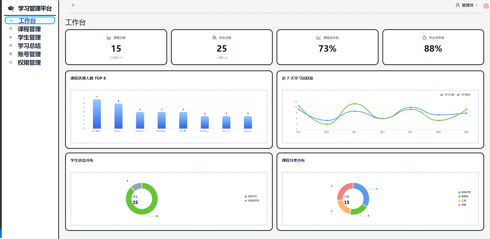
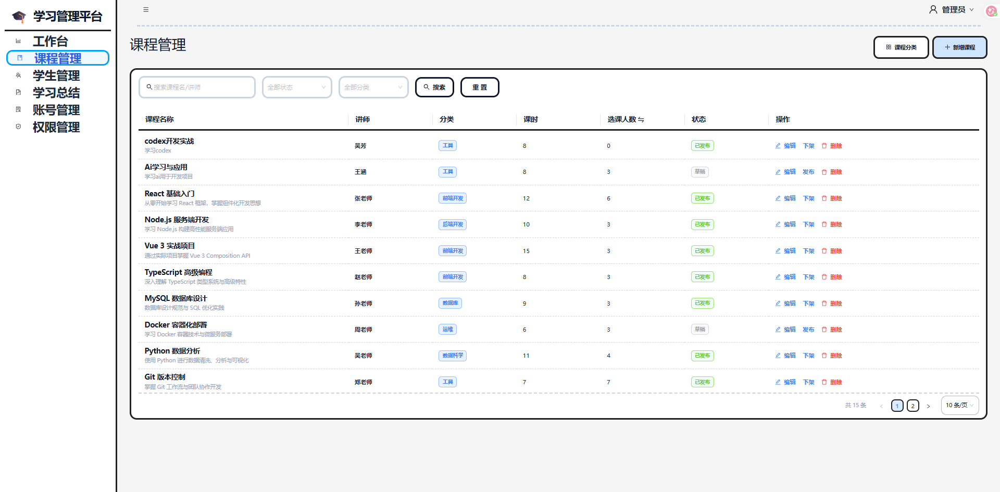
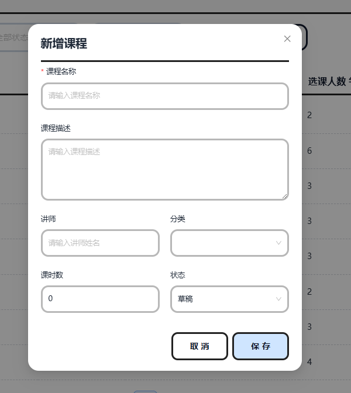
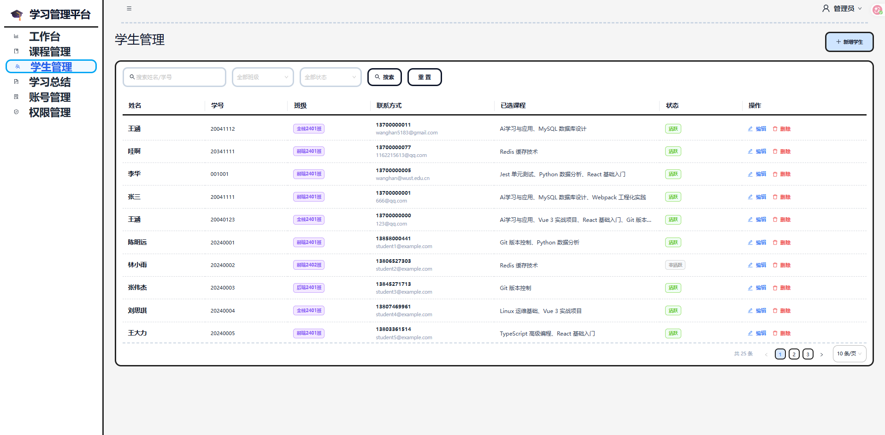
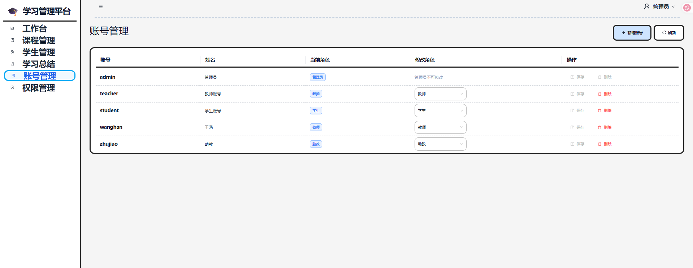
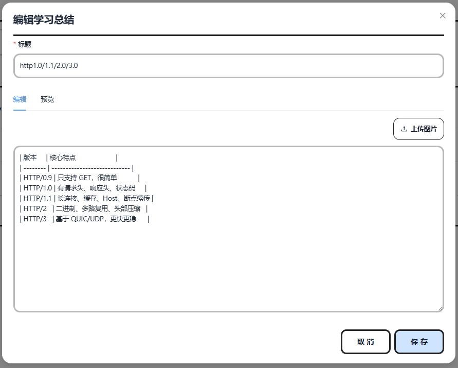
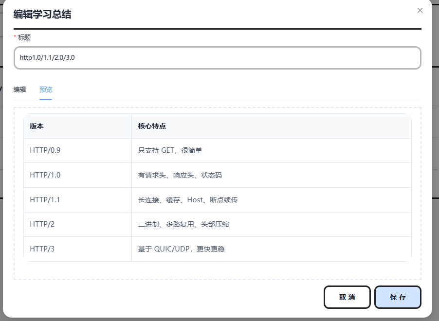
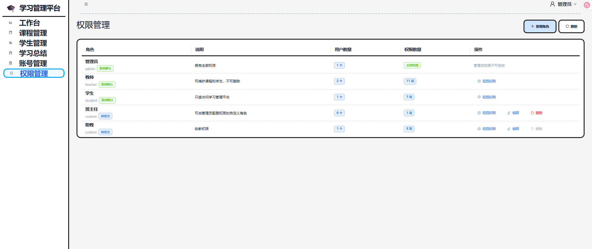

# EduFlow 在线课程管理平台

EduFlow 是一个前后端分离的在线课程后台管理系统，覆盖登录鉴权、动态 RBAC 权限、数据看板、课程管理、课程分类、学生管理、Markdown 学习笔记、账号管理和静态资源访问等常见中后台能力。

后端为 `server-nest`，使用 NestJS + TypeORM + MySQL 提供 REST API。`server` 目录保留 Koa + SQLite 旧版实现，可忽略。

## 预览

图片位于 `docs/images`，可在 GitHub README 中直接预览。

### 登录与工作台



### 课程管理与新增课程




### 学生管理



### 账号管理



### 学习笔记编辑与预览




### 权限管理



## 技术栈

**前端**

- React 19
- TypeScript
- Vite
- React Router
- Zustand
- Axios
- Ant Design
- Tailwind CSS
- ECharts
- react-markdown / remark-gfm
- react-syntax-highlighter

**默认后端**

- NestJS
- TypeScript
- TypeORM
- MySQL 8
- mysql2
- JWT
- bcryptjs
- Jest + Supertest

**旧版后端**

- Koa
- SQLite
- better-sqlite3

## 核心功能

- 登录鉴权：JWT 登录、登录态持久化、刷新恢复、401 失效清理。
- 动态权限：基于 RBAC 实现菜单、路由、按钮和接口四层权限控制。
- 数据看板：展示课程数量、学生数量、发布率、活跃率、分类分布和学习活跃趋势。
- 课程管理：支持列表、搜索筛选、分页排序、新增、编辑、删除、发布和下架。
- 课程分类：独立分类表，UUID 主键，支持新增、编辑、删除、查询和课程数量统计。
- 学生管理：支持学生列表、班级/状态筛选、新增、编辑、删除、多课程选择和学号唯一性校验。
- 学习笔记：支持 Markdown 编辑预览、代码高亮、代码复制和图片上传。
- 账号管理：管理员可新增、删除教师和学生账号，并调整普通账号角色。
- 静态资源：支持上传图片访问，也可由 NestJS 或 Docker Nginx 托管前端构建产物。

## 项目亮点

### 1. 前后端接口契约清晰

前端所有请求集中在 `client/src/api.ts`，底层统一经过 `client/src/utils/request.ts` 注入 token、解包响应和处理错误。

后端所有 JSON 接口保持统一响应结构：

```json
{
  "code": 0,
  "msg": "success",
  "data": {}
}
```

接口协议文档位于：

```text
server-nest/docs/Client 与 server-nest 接口协议文档.md
```

### 2. RBAC 权限闭环

项目采用数据库动态 RBAC，内置 `admin`、`teacher`、`student` 三类角色。后端根据角色和权限表返回权限码，前端根据权限码控制菜单、路由和按钮。

后端接口同时通过 JWT 鉴权和权限守卫做接口级校验，避免用户绕过前端直接调用接口造成越权操作。

### 3. 课程分类独立建模

课程分类不再从课程表去重得到，而是使用 `course_categories` 独立维护：

- `course_categories.id` 使用 UUID 字符串，避免手写数字 ID 导致后续修改混乱。
- `courses.category_id` 作为可置空外键关联分类表。
- `courses.category` 保留分类名称快照，用于分类被数据库层直接删除后的兜底展示。
- `course_categories.course_count` 写时维护，工作台分类分布直接读取该统计字段。
- 业务层不允许删除已有课程的分类，数据库 `ON DELETE SET NULL` 作为兜底保护。

### 4. Zustand 业务状态拆分

项目按业务领域拆分 Zustand store：

- `auth-store`：登录态、用户信息、权限判断、全局错误。
- `course-store`：课程列表、分类数据、筛选分页、表单和删除流程。
- `student-store`：学生列表、班级/课程支持数据、表单和删除状态。
- `summary-store`：学习笔记列表、详情、编辑和预览状态。
- `dashboard-store`：工作台统计和图表数据。

页面组件主要负责 UI 渲染和事件绑定，复杂异步流程集中在 store action 中。

### 5. TypeORM Migration 管理表结构

`server-nest` 关闭 `synchronize`，数据库结构由 migration 管理。首次启动可自动建库并按配置执行迁移；系统默认角色、权限和账号由初始化服务补齐，不和表结构迁移混在一起。

## 目录结构

```text
eduFlow-course-admin
├─ client
│  ├─ src
│  │  ├─ api.ts                  # 前端 API 封装
│  │  ├─ auth.ts                 # 登录态本地存储
│  │  ├─ App.tsx                 # Ant Design 主题和路由入口
│  │  ├─ components              # 通用组件、权限组件、图表组件
│  │  ├─ layouts                 # 后台主布局
│  │  ├─ pages                   # 页面模块
│  │  ├─ router                  # 路由、菜单、权限路由
│  │  ├─ stores                  # Zustand 状态模块
│  │  ├─ style                   # 全局样式
│  │  ├─ utils                   # 请求、分页、文本工具
│  │  └─ types.ts                # 前端类型定义
│  └─ package.json
├─ server-nest
│  ├─ src
│  │  ├─ auth                    # 登录、用户信息和密码接口
│  │  ├─ course-categories       # 课程分类字典管理接口
│  │  ├─ courses                 # 课程管理接口
│  │  ├─ database                # TypeORM 配置、实体、迁移和初始化
│  │  ├─ dashboard               # 数据看板接口
│  │  ├─ students                # 学生管理接口
│  │  ├─ summary                 # 学习笔记接口
│  │  ├─ system                  # 账号、角色和权限接口
│  │  ├─ upload                  # 图片上传接口
│  │  └─ static                  # 静态资源访问接口
│  ├─ docs                       # NestJS 后端与接口协议文档
│  ├─ test                       # 契约测试、迁移测试和工具测试
│  └─ package.json
├─ server                        # Koa + SQLite 旧版后端
├─ docs/images                   # README 预览图
├─ CLAUDE.md                     # 项目协作与维护约定
├─ 项目技术文档.md                # 项目整体学习文档
└─ README.md
```

## 本地运行

### 1. 准备 MySQL

本地需要 MySQL 8。默认配置如下：

```text
host: 127.0.0.1
port: 3306
database: eduflow_course_admin
```

复制后端环境变量模板：

```bash
cd server-nest
# Windows PowerShell / cmd
copy .env.example .env

# macOS / Linux / Git Bash
cp .env.example .env
```

根据本机 MySQL 修改 `server-nest/.env`：

```env
MYSQL_HOST=127.0.0.1
MYSQL_PORT=3306
MYSQL_USER=root
MYSQL_PASSWORD=
MYSQL_DATABASE=eduflow_course_admin
TYPEORM_MIGRATIONS_RUN=true
JWT_SECRET=change-me-in-production
```

开发环境默认可让 NestJS 启动时自动执行 TypeORM migration。生产环境建议显式管理迁移流程。

### 2. 安装依赖

```bash
cd server-nest
npm install

cd ../client
npm install
```

### 3. 启动后端

```bash
cd server-nest
npm run dev
```

后端默认运行在：

```text
http://localhost:3000
```

### 4. 启动前端

```bash
cd client
npm run dev
```

前端默认运行在：

```text
http://localhost:5173
```

Vite 开发环境会将 `/api` 代理到 `http://localhost:3000`。

## 默认账号

| 角色 | 账号 | 密码 |
| --- | --- | --- |
| 管理员 | `admin` | `admin123` |
| 教师 | `teacher` | `123456` |
| 学生 | `student` | `123456` |

## 常用命令

### 前端

```bash
cd client
npm run dev
npm run lint
npm run build
npm run preview
```

### 后端

```bash
cd server-nest
npm run dev
npm run build
npm test
npm run db:verify
```

### Docker

从项目根目录执行：

```bash
docker compose up -d --build
```

服务地址：

```text
client: http://localhost
server image: eduflow-course-admin-server-nest
```

Docker 中的 NestJS 后端通过 `host.docker.internal:3306` 连接宿主机 MySQL。`./server-nest/data:/app/data` 只持久化上传文件和静态资源，不存放 MySQL 数据。

首次部署前，先将 `server-nest/.env.example` 复制为 `server-nest/.env`，并填写宿主机 MySQL 的用户名、密码和数据库名。Compose 会自动把容器内的 `MYSQL_HOST` 覆盖为 `host.docker.internal`；不要在 Compose 中新增 MySQL 服务。前端容器仅暴露 `80` 端口，Nginx 会将 `/api/*` 转发到同一 Compose 网络内的 NestJS 服务，浏览器不需要直接访问 `3000` 端口。

常用 Docker 命令：

```bash
docker compose ps
docker compose logs -f server
docker compose down
```

## 数据库与迁移

`server-nest` 使用 TypeORM Entity 和 migration 管理表结构，核心表包括：

- `users`
- `courses`
- `course_categories`
- `students`
- `learning_records`
- `learning_summaries`
- `roles`
- `permissions`
- `role_permissions`

迁移和初始化分工：

- Migration 负责表结构、索引、外键和兼容性修复。
- Init 负责默认角色、权限字典、角色权限映射和默认账号。
- 课程、学生、总结等业务演示数据读取数据库已有内容，不在初始化逻辑中强行覆盖。

旧版 SQLite 数据迁移脚本仍保留在 `server-nest/scripts/migrate-sqlite-to-mysql.mjs`，用于从历史 Koa + SQLite 数据迁移到当前 MySQL 后端。

## 验证

提交前建议至少运行：

```bash
cd server-nest
npm test
npm run build

cd ../client
npm run lint
npm run build
```

当前后端测试覆盖：

- API 契约兼容
- TypeORM 配置
- 数据库初始化
- migration 兼容性
- 日期格式化
- 课程分类外键、UUID、课程数同步和分类筛选

## 文档索引

- [项目技术文档](./项目技术文档.md)：项目整体架构、前端、后端、数据层和面试问答。
- [CLAUDE](./CLAUDE.md)：项目协作、命令、权限、数据层和维护约定。
- [NestJS 后端技术文档](./server-nest/docs/NestJS%20后端技术文档.md)：默认后端的模块、请求链路、权限和迁移说明。
- [Client 与 server-nest 接口协议文档](./server-nest/docs/Client%20与%20server-nest%20接口协议文档.md)：前端 API 封装和 NestJS 接口契约。

## 生产化改进方向

- 将 `JWT_SECRET` 接入更严格的环境变量或密钥管理。
- 登录接口增加限流和错误次数控制。
- 学生和课程多对多关系从 JSON 字段升级为中间表。
- Markdown 渲染增加链接协议限制和 sanitize 白名单策略。
- 文件上传补充更严格的 MIME、扩展名、大小和存储路径校验。
- 增加前端交互 E2E 测试和关键接口压测。
- 使用 Lighthouse、Performance 或线上监控验证真实首屏性能。
